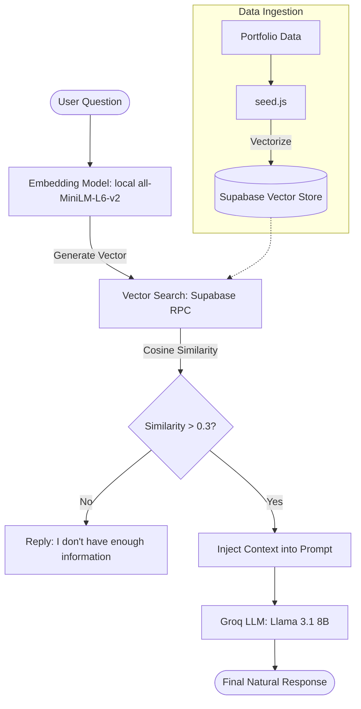

# 🤖 Portfolio RAG Agent

> A smart AI assistant (Digital Twin) built on **RAG (Retrieval-Augmented Generation)** architecture to answer questions about **Phan Tan Duy's** career, projects, and technical skills.

---

## 🌟 Key Features

- **Semantic Search:** Understands user intent beyond simple keyword matching using high-dimensional vectors (384 dimensions).
- **Context-Aware:** Responses are strictly grounded in real-world data stored in a Vector Database to prevent hallucinations.
- **High Precision:** Utilizes `similarity_threshold` and `priority scoring` to filter and rank the most relevant information.
- **Low Latency:** Powered by **Groq LPU** (Language Processing Unit) for near-instantaneous inference.

---

## 🛠 Tech Stack

| Component           | Technology                                               |
| :------------------ | :------------------------------------------------------- |
| **LLM**             | `llama-3.1-8b-instant` (via Groq Cloud)                  |
| **Vector Database** | **Supabase** (Postgres + `pgvector`)                     |
| **Embedding Model** | `all-MiniLM-L6-v2` (Running locally via Transformers.js) |
| **Backend**         | Node.js, Express, Axios                                  |
| **Language**        | JavaScript (ES Modules)                                  |

---

## 🧠 System Architecture & Workflow

The project operates following the standard RAG pipeline:

- **Ingestion:** Portfolio data (JSON) is converted into vectors and stored in Supabase.
- **Retrieval:** When a user asks a question, the system vectorizes the query and calls the - match_documents_portfolio (SQL) function to find relevant matches.
- **Augmentation:** The retrieved context is injected into an optimized System Prompt.
- **Generation:** The enriched prompt is sent to the Groq LLM to generate a natural, human-like response.

### Workflow Diagram

## 🚀 Getting Started

Will be update later
